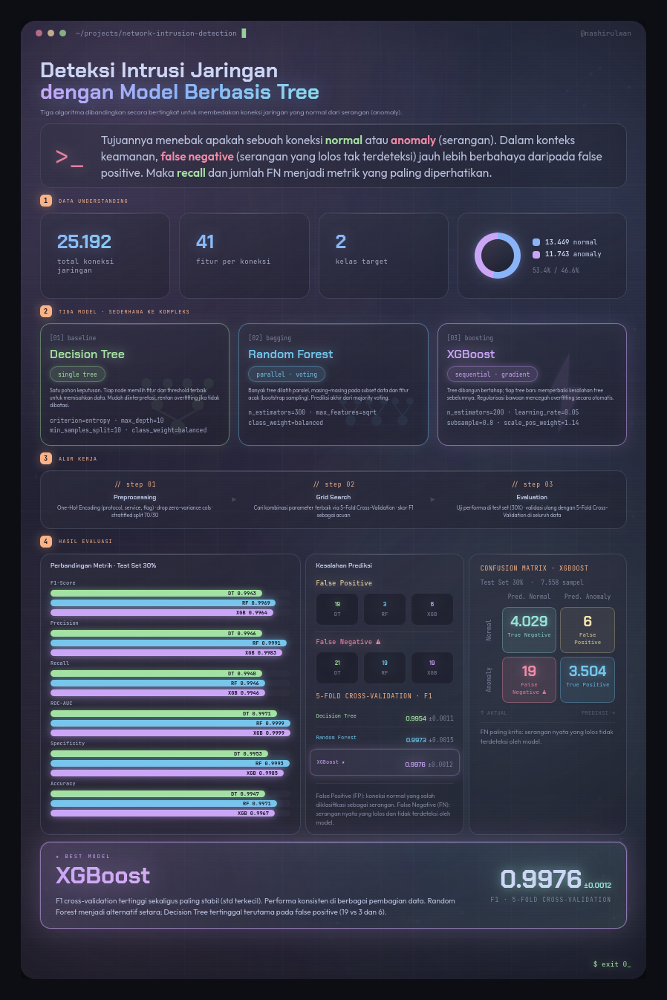

### Network Intrusion Detection

Comparing three tree-based models — Decision Tree, Random Forest, and XGBoost — at telling normal network traffic apart from attacks. Data science course project.

#### Overview



> The infographic above summarizes the project at a glance. The full version is in
> [`reports/infografis.html`](reports/infografis.html).

**Headline results (test set, 30%):** all three tree-based models reach ~0.99 across
accuracy, F1-score, recall, and ROC-AUC, with Random Forest and XGBoost edging out the
single Decision Tree. F1-score (validated with 5-fold cross-validation) is used as the
main reference metric. See the infographic above for the exact per-metric figures.

#### Environment

Run JupyterLab from the Nix development environment:

```bash
nix develop --command jupyter lab
```

Or enter the development shell first:

```bash
nix develop
jupyter lab
```

#### Project Structure

- `data/raw/`: original dataset files from Kaggle.
- `data/processed/`: processed datasets, if needed.
- `notebooks/`: experiment and analysis notebooks.
- `outputs/figures/`: generated visualization outputs.
- `outputs/models/`: saved model artifacts, if needed.
- `reports/`: report drafts or writing notes.

#### Dataset

Dataset source:

https://www.kaggle.com/datasets/sampadab17/network-intrusion-detection

Download the CSV files from Kaggle and place them in `data/raw/`.

Files used:

- `Train_data.csv`: labeled data used for training and evaluation with an internal train-test split.
- `Test_data.csv`: unlabeled data, not used for metric calculation.

#### Methodology

This project follows the Data Science methodology used in the course:

1. Business Understanding
2. Data Understanding
3. Data Preparation
4. Modeling
5. Model Evaluation

#### Experiment Focus

Main experiment setup:

- Binary classification: `normal` vs `anomalous`
- Compared models: Decision Tree, Random Forest, and XGBoost
- Evaluation metrics: accuracy, precision, recall/sensitivity, specificity, F1-score, confusion matrix, and ROC-AUC
